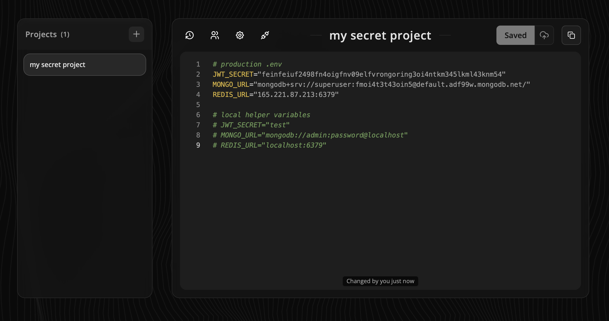

<div align="center" width="100%">
    
</div>
<br/>
<p align="center">
  <a href="https://discord.gg/FwzmtYkc"></a>
</p>

# Cryptly 🔑

<div>
    <b>A free, secure, collaborative secrets management platform with end-to-end encryption</b>
</div>

<br/>

<div align="center">
    
</div>

<br/>

<div align="center">
    <a href="https://cryptly.dev">cryptly.dev</a>
</div>

## ⭐ Features

- **🔒 End-to-end encryption** - Your secrets are encrypted on the client side, server never sees plaintext
- **👥 Team collaboration** - Share encrypted secrets with team members via secure invitations
- **📝 Version history** - Track all changes to your secrets with full version control
- **🔄 GitHub integration** - Sync secrets directly to your GitHub repositories
- **🎨 Modern UI** - Beautiful, responsive interface built with React
- **🚀 Real-time updates** - See changes instantly with SSE support
- **🔑 Multiple auth ooptions** - Login with Google, GitHub, or local development mode
- **📦 Project organization** - Organize secrets by projects for better management

## 🔐 Encryption Architecture

### User key pair generation

Upon account creation, an asymmetric RSA-OAEP key pair is generated client-side within the user's browser. This key pair forms the foundation of the user's cryptographic identity within the system.

### Private key protection

The generated private key is encrypted using a user-provided passphrase before any storage operations occur. This ensures that the private key remains protected even when stored on the server infrastructure.

### Key storage and multi-device support

To enable cross-device access, the encrypted private key is stored on the server. During authentication from a new device, the encrypted private key is retrieved and decrypted locally using the user's passphrase. The server never has access to the unencrypted private key or the passphrase.

### Project-level encryption

When a new project is created, a random symmetric encryption key is generated client-side. This project-specific key is then encrypted using the user's public key and stored alongside the encrypted project content. All project secrets are encrypted and decrypted using this symmetric key, ensuring optimal performance while maintaining security.

### Secure project sharing

#### Using link

The project sharing mechanism employs a temporary asymmetric key pair to facilitate secure transfer:

1. A temporary RSA-OAEP key pair is generated for the invitation
2. The project's symmetric key is encrypted using the temporary public key
3. An invitation-specific code is used to encrypt the temporary private key
4. When a recipient claims the invitation, they provide the invitation code to decrypt the temporary private key
5. The temporary private key is used to decrypt the project's symmetric key
6. Finally, the project key is re-encrypted using the recipient's public key

#### Invite existing account

When inviting an existing account directly, the process is streamlined as the recipient's public key is already available:

1. The project's symmetric key is encrypted directly using the recipient's stored public key
2. A new encrypted project key version is created for the recipient
3. No invitation code is required as the recipient can immediately decrypt using their private key
4. The recipient gains instant access to the project upon invitation acceptance

This cryptographic workflow ensures end-to-end encryption throughout the entire project lifecycle, maintaining zero-knowledge architecture where the server cannot access plaintext data at any point.

## 🚀 Quick Start

### Local Development

Get up and running in one command:

```bash
make local
```

This will:

- Install all dependencies (npm + pnpm)
- Set up environment files automatically
- Start MongoDB in Docker (port 2137)
- Launch backend on `http://localhost:3000`
- Launch frontend on `http://localhost:5173`

> **Note:** Local development mode includes simplified authentication - just enter any email to log in!

## 🤝 Contributing

Contributions are welcome! Please feel free to submit a Pull Request.

## 📝 License

This project is licensed under the MIT License.

<div align="center">
    Made with ❤️ for developers who care about security
</div>
